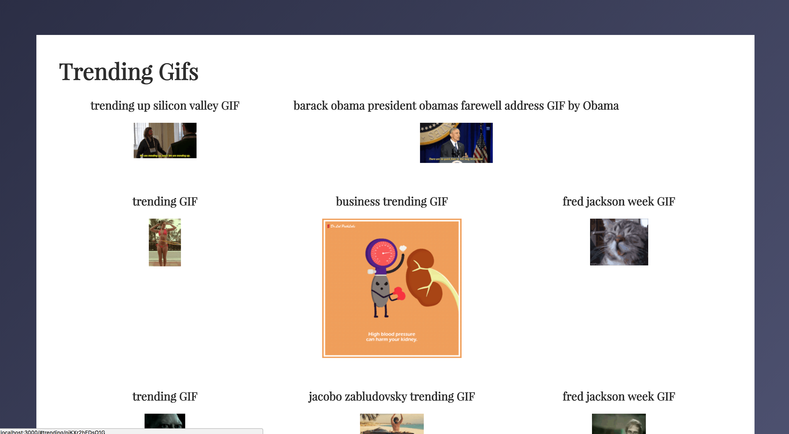
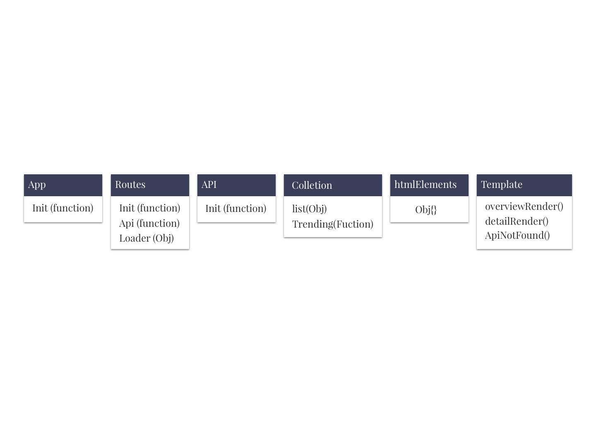
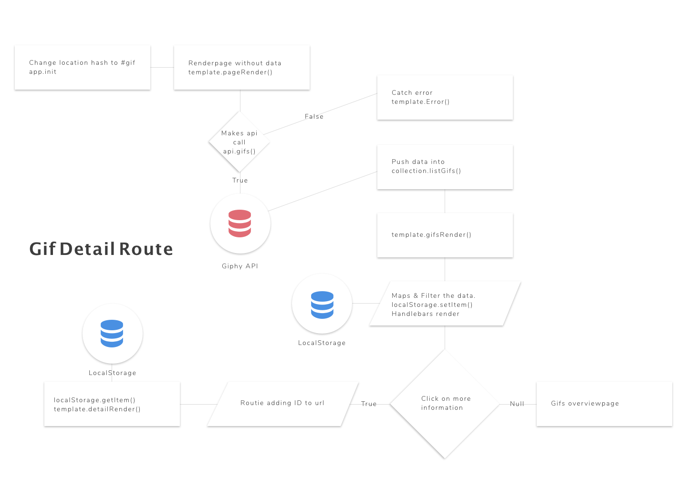

# Gif App.
This app is made for  _trending_ gifs.
[Website](https://senmetsu.github.io/wafs/.)

## Description
This app is made for top 10 trending gifs, it will show the trending gifs at this momemnt of time. 
If you click on the title, you will go to the detail page that will contain some information.

### Trending Page


### Detail Page


## Code Examples

My Router does alot in its code, It checks for the hash and gets the API in.
If the hash corresponds with the `routie` it will render the web pages.
```Javascript
var routes = {

  apiPromise: function() {
    return api.init()
      .then(
        function(data) {
          localStorage.setItem('trendingData', JSON.stringify(data))
          window.location.hash = '#trending'
        })
      .catch(function(err) {
        console.log('error', err);
        routie('notFound')
      })
  },

  init: function() {
    routie({
      'notFound': function() {
        template.apiNotFound();
      },
      'trending': function() {
        var data = JSON.parse(localStorage.getItem('trendingData'));
        collection.trending(data)
        template.overviewRender(collection.list.trendingImages)
      },
      'trending/:id': function(id) {
        var data = JSON.parse(localStorage.getItem('trendingData'));
        collection.trending(data)

        collection.list.trendingImages.forEach(function(data) {
          if (data.id == id) {
            template.detailRender(data)
          }
        })
      }
    })
    this.apiPromise()
  },
  loader: {
    show: function show() {
      htmlElements.loader.classList.remove('hide')
      htmlElements.loader.classList.add('show')
    },
    hide: function hide() {
      htmlElements.loader.classList.remove('show')
      htmlElements.loader.classList.add('hide')
    }
  }
};
```

I made a htmlElements object to help my rendering template.

```Javascript
var htmlElements = {

  body: document.querySelector('body'),
  ul: document.createElement('ul'),
  h1: document.createElement('h1'),
  p: document.createElement('p'),
  loader: document.querySelector('svg')

}

// exporting
export default htmlElements
```

my `API` works one time. and stores the data in the collection module.

```Javascript
// importing
import api from './api.js';

var collection = {
  list: {
    trendingImages: [],
  },
  trending: function(data) {
    data.data.forEach(item => {
      this.list.trendingImages.push({
        id: item.id,
        title: item.title,
        image: item.images.preview_gif,
        source: item.source_tld,
        image_big: item.images.original
      })
    });
  }
}

// exporting
export default collection
```

## Actors Diagram
Every part of this app has an role.



## Flow Diagram
The flow of `this` app is important. The Actors will play their `role` to  
make the user happy.


## My Progress
It was a difficult app but I have a feeling I learned alot from it. 
OOP style is interesting but confussing sometimes.  

## What could I have done more?
Next time I will be focusing on the data a bit more to make it more complex. 
I also need to play a bit more with `routie` so I can feel comfortable with it. 

## Features
* [Routie](http://projects.jga.me/routie/)
* [Handlebars](http://handlebarsjs.com/)
